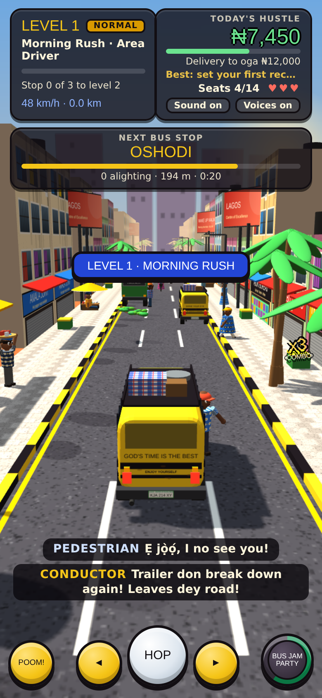
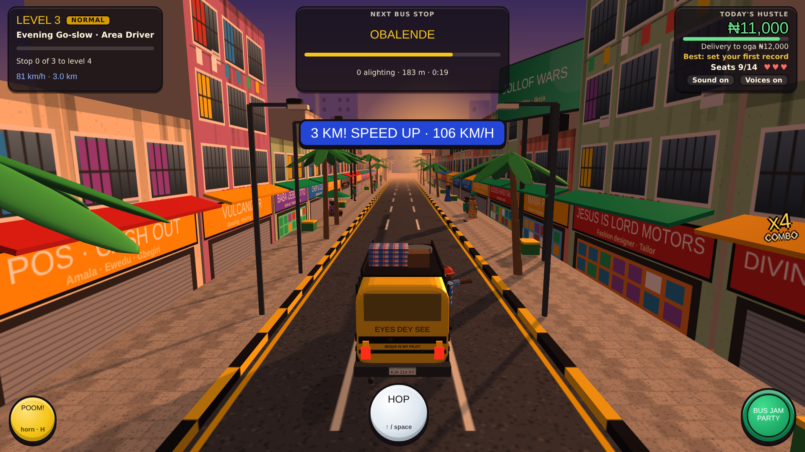
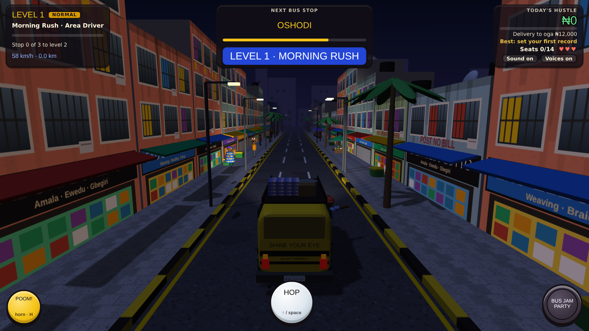
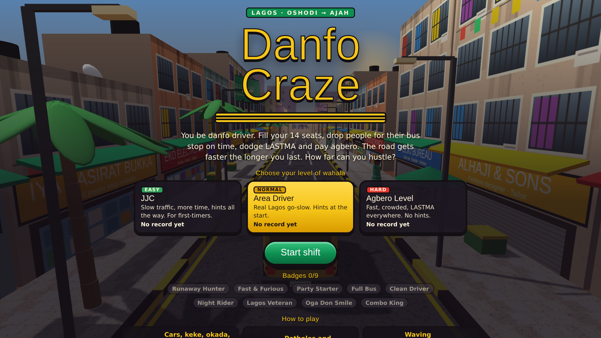

# Danfo Craze (prototype v0.3)

A 3D endless driving game set on Lagos roads. You're a danfo driver: fill your seats, drop passengers at
their stops on time, get past the go-slow, and make the owner's daily "delivery". The whole game is one HTML file
(Three.js from a CDN) and runs in the browser on phone or laptop. Open `index.html` to play.

## Screenshots

| Laptop | Phone |
|---|---|
|  |  |
|  |  |
|  | |
|  | |

## How to play

| Thing on the road | What to do |
|---|---|
| Cars, danfos, BRT, keke, okada (some ride against traffic) | Change lane. 3 hits end your day |
| Potholes, speed bumps | **Hop** (↑ / Space / HOP button) |
| Broken-down trailer with tree branches on the road | Change lane early |
| Person crossing the road without warning | Change lane, or hit the horn so they hurry |
| Waving passenger (green marker) | Drive into them. They pay at their stop |
| Bus stop | Reach it before the timer runs out, or passengers pay half. Agbero collects ticket money at every stop |
| LASTMA officer | Avoid their lane or pay a ₦2,000 fine |
| One-way shortcut | Saves 120 m, but police chase you for 10 s. Crash during the chase and you pay a "settlement" |
| Runaway passenger (red marker) | Steer into them to collect your money |
| Horn (H) | Keke, okada and pedestrians in front of you move out of the way |
| Bus Jam Party (P) | Fills as you pick up passengers: music, double naira, and traffic flies out of your way |

## What keeps you playing

- **Difficulty**: JJC (easy), Area Driver (normal), Agbero Level (hard).
- **Levels**: Morning Rush, Afternoon Hustle, Evening Go-slow, Night Run, then Day 2 and beyond. The lighting changes with each level.
- **Speed keeps climbing** with every level and every kilometre, with "SPEED UP" and distance bonuses along the way.
- **Combos up to x5** from coins, pickups, clean hops and near misses. A crash resets it.
- **High score** saved per difficulty (in the browser), with a "NEW HIGH SCORE" banner mid-run.
- **9 badges** to collect, such as Runaway Hunter, Fast & Furious, Full Bus, Night Rider and Lagos Veteran.

## Sound

Everything is synthesised in the browser: traffic rumble, the danfo engine, horns from all sides, police sirens and whistles,
crowd noise, and an afrobeat-style Bus Jam Party beat. Characters speak (conductor, police, LASTMA, agbero, hawkers, a preacher,
people fighting, pedestrians) in Yoruba and pidgin, through the device's speech engine, with subtitles.
Sound and voices can be switched off separately.

## Research

See [`RESEARCH.md`](RESEARCH.md) for sourced notes on danfo economics, conductor culture, enforcement and policy.

> Naming note: the earlier working title "Danfo Driver" is also a 2003 song by Mad Melon & Mountain Black.
> Check "Danfo Craze" for trademarks before any commercial release.
