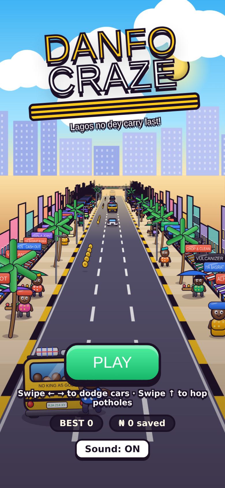
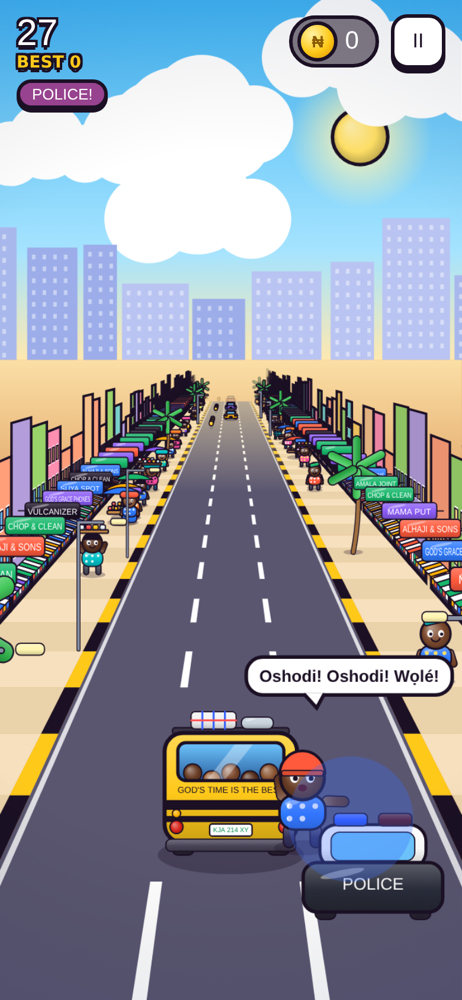
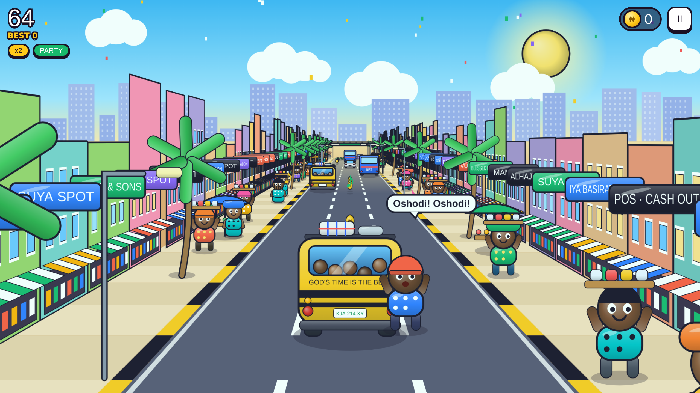

# Danfo Craze (prototype v0.4)

A simple swipe runner in the style of Temple Run and Subway Surfers, set on Lagos roads. You drive a danfo that went the
wrong way down a one-way street, and the police are chasing you. One HTML file with no libraries. Open `index.html` on a
phone or laptop.

| Title | First-run hint | Bus Jam Party |
|---|---|---|
|  |  |  |

## How to play

- **Swipe ← →** (or arrow keys) to dodge cars, danfos, keke, BRT buses and okadas coming the wrong way. Hitting one ends the run.
- **Swipe ↑** (or Space) to hop over low obstacles: potholes, tree branches and LASTMA barriers. You can't hop over a car.
- Trip on a low obstacle and the police close in. Trip again while they're close and you're caught.
- Squeeze past a car at the last moment for a **CHANCE AM!** bonus.
- Collect naira coins and waving passengers. Grab the speaker for a **Bus Jam Party** (smash through traffic, double points) or the magnet to pull in coins.
- The speed keeps climbing. Beat your best score.

Every row of traffic leaves one lane open, and that lane is never more than one swipe from the previous open lane, so there's always a way through.
The first run slows down and shows a swipe hint the first time you need to dodge and the first time you need to hop.
The scenery cycles through Oshodi Market, Third Mainland Bridge and Lekki.

Sound is synthesised in the browser: afrobeat music, horns, sirens and crowd noise. There's no talking; conductor calls
appear as speech bubbles.

See [`RESEARCH.md`](RESEARCH.md) for the background research on danfo life in Lagos.
